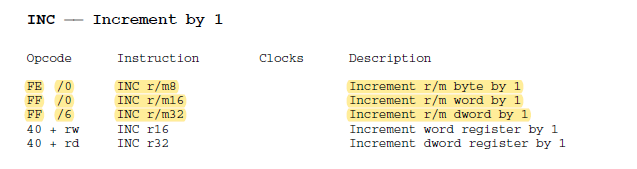
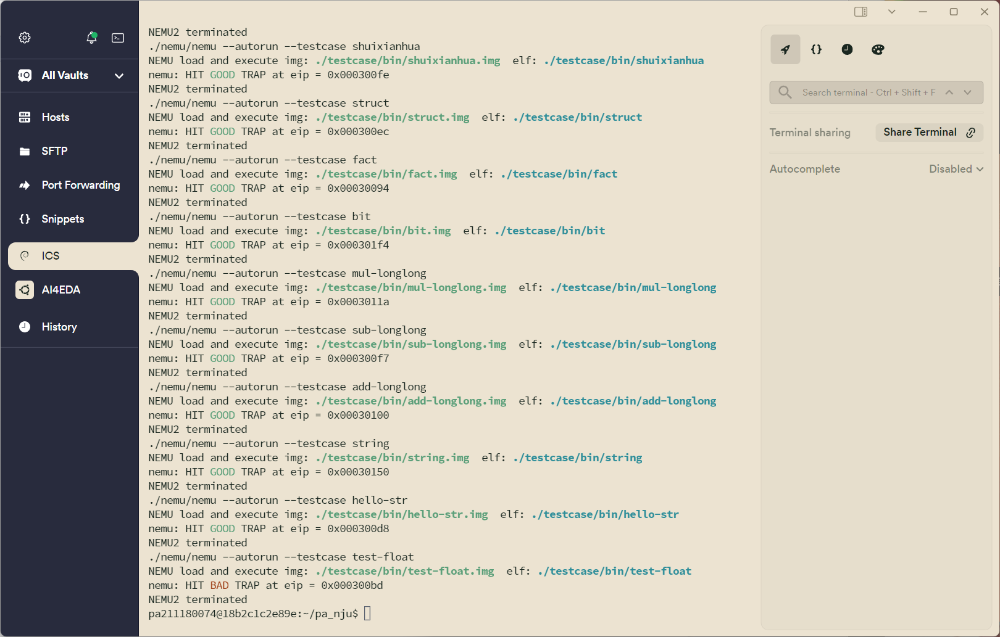
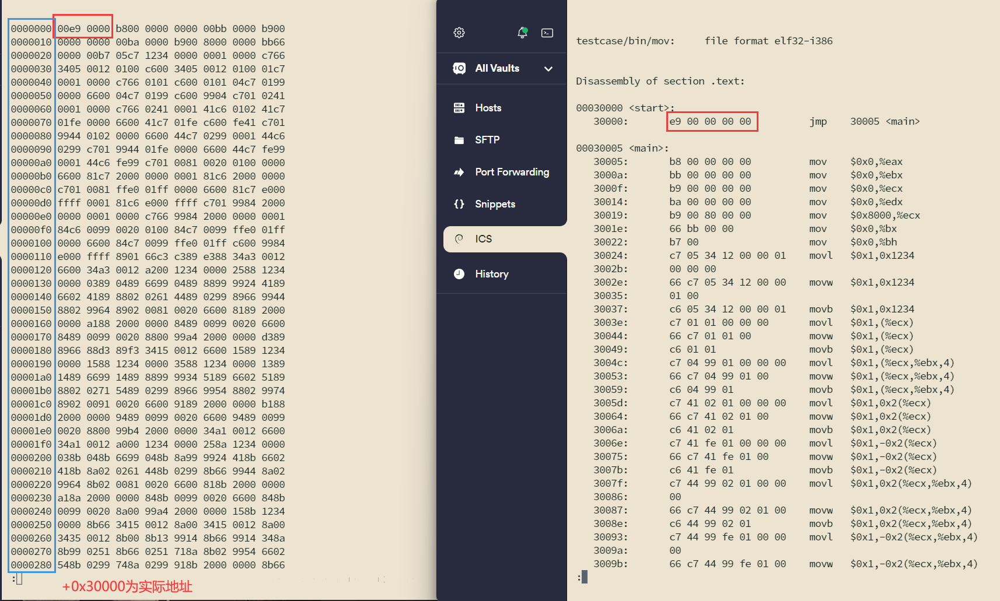
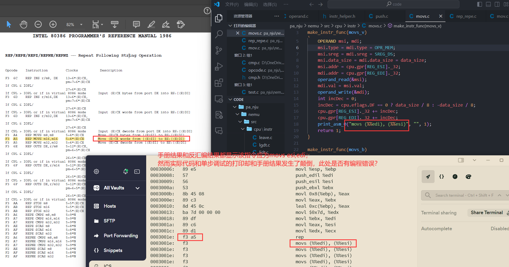

# PA2-1 实验报告

211180074 彭安澜

2024 年 4 月 16 日

## 实验代码及重点问题

本次实验完成了较多指令的实现，具体代码已经全部通过git commit进行提交，此处不再一一展示。下面对编程中遇到的一些重点问题和错误解决做一个总结。

### Appendix A出现的Group指令

特别注意：处理遇到的第二条invalid opcode时，可以看到opcode是0x83；如果使用反汇编工具将看到是cmp指令；但如果查阅appendixA会发现这是一条“Grp1 Ev, Ib（注意到手册有错！）”的指令，这实际上是一种特殊指令，由后面的ModR/M字节的5, 4, 3位告知实际的指令，例如此处为111，就代表实际为cmp指令；在编程过程中同样注意到0x83处已经填上了group_1_bv，这个函数在group.c中给出定义，可以看到，执行group_1_bv函数主要完成了两步，首先完成了对操作码后modrm字节的解码，然后根据解码结果，调用group_1_bv_entry[opcode]这一函数指针数组中与modrm字节解码结果相对应的某一个函数；group_1_bv_entry[opcode]在opcode.c文件中定义，以外部变量的形式在group.h中声明；因此对完成的Grp1_bv（即opcode 0x83）中的某个指令（例如cmp），要将完成函数的函数名填写到opcode.c的group_1_bv_entry[opcode]的对应条目的定义当中（例如cmp是group_1_bv的第七个指令，在appendixA的最后一页可以查到，就要在group_1_bv_entry[opcode]的第七个变量位置，填上自己编写的cmp_i2rm_bv函数的名称）。

### sign_ext指令的正确使用

虽然这个指令在PA-1中我们已经频繁使用过，但仍不排除一段时间不用，忘记其正确用法的可能性：注意sign_ext(x, datasize)函数一定是把datasize位的x的最高位扩展到32位，而不是把x的最高位扩展到datasize位，这个在编写cmpi2rmbv函数中对i进行位扩展时容易弄错！

### 已经完成了cc的编写，却还提示报错

代码框架中基本所有的条件转移指令（jcc、setcc等）基本上都已经完成，只需在instr._helper.h完成对应的cc（判断条件）的宏定义即可，但实际操作中却发现明明已经写完了所有的cc，却还是会遇到inv_cc的报错提示，甚至把inv_cc函数注释掉了也没用。

出现这种情况是因为开发者认为这里的指令已经布置好了，就没有对.c文件做任何改动；但如果真的不对.c文件进行改动，make就会根据时间戳不对这个.c文件重新进行编译；这实际上产生了一个严重的问题，因为对部分.h文件做了修改（例如此处要修改instr_help.h文件来完成cc条件的编写，更该了宏的设定），因此.c文件虽然没被修改，但因为对应.h文件的变化，该.c宏展开的代码实际上是变了的，需要重新编译，但make意识不到这一点；至于为什么注释掉inv_cc也能打印报错，是因为inv_cc函数是在头文件中以inline形式定义的，本质也是宏展开；最后的结果就是虽然改了.h文件，但没有修改过的.c文件产生的.o文件仍然是采用老的.h文件编译出的结果；一种解决方法是在改了.h却不需要改.c的对应.c文件中，加入一两行注释，就可以引导编译器重新编译；更好的方法是make clean，然后全部重来。

总结来说，养成**make clean的好习惯**！（虽然可能也没必要每次都make clean）

### cc的多种等价描述

另外注意到在cc中，有许多等价的表述，例如be和na（below equal 等价 not above），这在手册没有统一的规范，同时在代码中又都给出定义（实际来说有16种cc，而框架代码中至少给出了18种cc，有的cc只是同名，本质一样），其中相对难想的是，b（below）和c（carry out），实际上below的判断条件就是减法发生了借位（carry out），这个在填写setcc到opcode.c中会遇到。

### print_asm_x函数的使用说明

以 `print_asm_2("cmp", "bv", len, &imm, &rm);` 为例，首先明确这个函数的作用是在nemu的debug界面上用，配合si单步执行命令打印出当前指令的执行情况，可以将结果与objdump4nemu-i386反汇编的结果进行比较，从而判断当前指令书写是否存在问题。

因此这种帮助debug的语句放置有讲究，不一定非要放在instr_execute_2op()之前，因为有的时候在指令执行时会涉及到一些对操作数的赋值操作，例如在执行bv指令时可能涉及位扩展的操作，在objdump4nemu-i386中的反汇编结果是会自动完成位扩展的，因此可能先执行位扩展操作，再执行print_asm函数，才会有与反汇编相同的结果（当然后来也发现这是做不到的，见下一段）；当然也不一定放在instr_execute_2op()之后，因为往往执行了instr_execute_2op()之后，各变量的值发生变化（如mov等），也会产生误导；简而言之理想状态下 `print_asm_2("cmp", "bv", len, &imm, &rm)`打印出的内容应该和反汇编工具得到的结果有相同的输出。

但这并不总能做到，这就涉及到框架代码的问题。阅读代码知，`print_asm_2("cmp", "bv", len, &imm, &rm);`函数可能会触发operand_read等函数（例如对imm数，代码就会有该动作），这就意味着如果对operand类型的操作数进行了读操作后，又直接对operand.val进行了其他操作（例如位扩展），则执行 `print_asm_2("cmp", "bv", len, &imm, &rm);`，之前的操作会失效，operand.val会恢复operand_read返回的val值，此时若再进行instr_execute_2op()，就无法得到预期的效果，此时会出现一个有趣的现象，执行 `make test_pa-2-1`会显示 hit good trap（因为此时不执行print_asm_2函数），但 `make run`却会显示 hit bad trap，因为调试状态下才会调用这个函数。

所以这就意味着没法完全在调试界面中让(nemu) si打印的结果，和反汇编工具输出的结果一致，例如对指令 `0x83 f8 03`，反汇编工具结果为 `cmp $0xffffff80,%eax`（执行了位扩展），而si打印结果只能是 `cmpbv $0x80 %eax`，即使对立即数做了位扩展也没有用，因为print_asm_2函数会重新读取变量的值。个人觉得这种设计可能不好，**print_asm作为一个“打印函数”，不应该具有修改变量值的功能**，这对代码编写也带来困扰。

总而言之，print_asm_2要么放在全部instr_execute_2op()之前，要么全部放在instr_execute_2op()之后，无论print_asm_2的打印结果正确与否，优先保证print_asm_2在存在或不存在（因为这个函数只在调试模式下触发）时，指令的运行结果都是正确的。

### make test_pa-2-1能通过测试案例，make run却不能

原因已经在上面解释过；实际操作中，这确实是一个很容易让人摸不着头脑的事情。

### __ref_xxx二分法辅助代码调试

很多时候我们写到后面的指令，在测试案例中，会因为前面指令书写不严谨的地方导致hit bad trap，因此如何定位到底是哪条指令写错是很重要且困难的一件事情，一种有效的方法就是出现bad trap时可以在报错的eip附近的指令初步锁定一个debug范围（这个范围往往是前一个没有触发bad trap的nemu_trap和当前触发bad trap的nemu_trap之间），然后用黄金实现的版本（如果你的函数命名足够规范，将自定义的函数前加上__ref_（ref前面两个下划线，后面一个下划线）就会是黄金实现的版本）替换掉各个指令精准确定出现bug的指令。

然而这种方法在后面指令特别多，而nemu_trap又设置的特别少时难以奏效，因此可以考虑大范围的将指令换成黄金实现的版本，比如每次替换一半，查看案例能否通过；从而通过不断二分法，找到最后出现问题的指令。这里也有个快捷方法完成替换：在Vscode中，可以使用ctrl + d选中前后具有相同字符的字符串，并可以对他们进行同时编辑，通过这种方法，选中","可以完成__ref_黄金版本代码的快速替换；类似的，也可以辅助将jcc，setcc这些指令添加到opcode.c中去。

就经验而言，大部分段错误（segmentation fault），bad trap都来自各种跳转指令（call、ret、jmp等）。

### instr_execute_2op()用哪个变量作为数据长度比较合适

考虑到 `instr_execute_2op()`是一个要服务众多函数的函数（构成了宏的核心部分），我们希望它能尽可能满足各种函数的要求，从而减少单列的函数来节省编程的时间。那么在这一函数中datasize如何选择是一个重要问题（datasize就是我们指定的执行指令（例如alu_add）时所要指定的操作数长度）。首先直接选全局变量data_size不是一种好方法，因为有的时候操作为byte（8位），而全局变量data_size只能是16或32位。一种想法是在书写static void instr_execute_2op() 函数时，尽可能datasize都选择opr_dest.data_size，虽然只是偶尔有不定长现象，但不定长的时候都是src的立即数扩展到dest的长度，所以取opr_dest.data_size比较稳妥。

但上述说法也有例外，在push这种无视操作数长度，操作数长度一律取全局变量data_size的情况下，就不能这么做，具体见后文。

### 返回指令长度问题

如实验手册中所写，在jmp、ret涉及绝对地址跳转时，返回指令长度应为0，这里再做一些补充说明：

一般绝对值跳转命令的返回值必须设置为0，确保下一个指令就是跳转到的位置，而不是还有额外的自增；但是在相对值跳转时，返回值仍然应该设置为当前指令长度，例如jmp_near rel，实际跳转的位置应该是“**距离下一条指令rel个字节处的指令**”，但是也有**例外**——对call_near rel，他需要将当前指令**下一条指令**压入（push eip）堆栈以备执行完函数后继续执行下面的指令，因此在执行push前必须先完成eip的自增，然后再把自增后的eip再加上偏移量rel，同时一定要设置返回值为0，避免重复自增！

这一点很容易出错，因为手册上并没有提出eip需要先自增（这实际上是另一个问题，**在手册中，所有的eip，指的都是当前指令的下一条指令的地址，这是约定俗成，符合硬件行为的**），再压栈；如果直接压栈，就会把当前指令不断压栈再出栈，最终形成死循环，同时还看不到任何bad trap或其他报错信息，也容易让人迷惑。

### 手册中的印刷错误

手册绝不权威，实际上来讲，手册可以说是错误百出，但这些错误实际上并不难鉴别，只要稍加留意。

以inc指令为例，手册中出现错误：

FF /0就是 inc ev，能同时使用word或dword长度的操作数，这里第三行是印刷错误（FF /6实际为push ev）；但这种错误不难鉴别，因为几乎所有word和dword长度的指令，都共享同一个opcode（也就是v类型）。

### Grp4缺失，需要手动补充

前面已经对Grp1做出了介绍，在实际编程中，我们还要手动对某个Group进行添加，这其中涉及到较多文件，如果使用网页编译器，可能很难找齐这些文件，使用Vscode（或其他ide）可以直接查看某一函数定义/声明的位置，可以免去一些麻烦；这里对这一过程进行描述：

代码在完成inc eb指令时，发现缺乏对grp4的定义（inc eb为group4[0]），因此要到opcode.c里定义新的函数数组，且命名必须为group_4_entry，否则不能用宏；然后到group.c里完成组函数的定义，在group.h里完成对应函数声明，同时要把opcode.c里定义的函数数组以全局变量形式在group.h里声明。

### 0x0f 两字节特殊指令

注意到在附录A中看到0x0f有一个two byte opcode的指令，这个在次一页中有说明，这就是特殊的拥有两个字节长度的操作码的指令。

### 不是所有指令都要实现

不是手册上所有指令都要实现，ics的nemu使用的是一套简化版本的指令集，在编写某一指令时，可以顺手把该.c文件中涉及的指令都实现，但如果是很麻烦的也可以先不着急，因为这一指令不一定是必要的。

### push和pop无视操作数长度，只看栈长度（data_size）

在push和pop函数中，明确指明了栈针只能按2或4变化，但是存在push或pop操作数为8位的情况，此时栈针仍然按一个word或doubleword（取决于全局变量datasize）变化，所以对例如push_i_b，需要特别关注。此外还有一个问题就是在操作数为8位时，除了栈针仍然按一个变化，还一定要记得对高位清零；具体来说：向栈中写数据（push）的时候，调用operand write函数一定要注意让栈顶下移的字节数和写入的字节数（也就是operand size）一致！如果写入字节数更少，否则高位不会自动清零，上次退栈的数据还会残留在栈中。

### 严格遵循指令执行顺序

一定要严谨地遵守手册中给出的操作顺序，例如在ret near imm16中，完成的指令是将栈顶元素通过pop的方式传给eip，然后同时给esp一个偏移量（这大概就是模拟了调用完函数返回，接着执行主函数，同时还释放了调用函数过程中存放在栈中的变量），这时就决不可以先给esp偏移量（清栈），再pop，因为pop依赖esp来正确返回在栈顶的元素（也就是主函数接下来要执行的指令）。

# 运行结果

看到了除最后一个案例外，所有的GOOD TRAP，不过eip号和PPT中示例有所不同，猜测是示例代码的版本问题。

# 实验思考题

1. **使用 `hexdump`命令查看测试用例的.img文件，所显示的.img文件的内容对应模拟内存的哪一个部分？指令在机器中表示的形式是什么？**
   以第一个testcase mov为例：分别执行 `./testcase/objdump4nemu-i386 -d testcase/bin/mov | less`和 `hexdump testcase/bin/mov.img | less`，进行比较（左边为hexdump结果，右边为反汇编结果）：

   

   从红圈内容不难看出（注意到看上去内容略有差距，这实际上是小端序导致的，hexdump结果以一个word（16位）为单位，在单位内高位在前，单位外按小端序低有效在前；而反汇编结果以一个字节为单位，同样为小端序；如果都按大端序表示前四个字节，则内容都为00 00 00 e9），hexdump的第一行的起始位置，就对应模拟内存的0x30000地址，两者间存在30000的偏置。

   总结来说，.img文件存放在0x30000开始的Physical Memory中，在此之前的物理内存，用来做RAM Disk。

   指令在机器中是用二进制01码的形式表示的。
2. **如果去掉 `instr_execute_2op()`函数前面的 `static`关键字会发生什么情况？为什么？**

   如果不加上static关键字限定函数作用域在当前指令的.c文件中，则每个指令都会有一个特定的 `instr_execute_2op()`函数，这些函数在编译过程中将引起错误，提示函数被重复定义，也就是每个指令不仅能看到自己的 `instr_execute_2op()`函数，还能看到其他指令的 `instr_execute_2op()`函数，这就引起了错误。（实际上来讲 `instr_execute_2op()`函数虽然未在任何.h文件中被声明，但若不给与static关键字，通过extern声明的方式，仍可以在其他.c中被调用）。

   而且这样的问题不能通过改名字来解决，因为宏的定义，我们必须把指令执行函数叫做 `instr_execute_2op()`。
3. **为什么 `test-float`会 `fail`？以后在写和浮点数相关的程序的时候要注意什么？**

   精度问题。在nemu中，我们使用定点指令模拟fpu来完成浮点数的运算；但在真实情况中，通用计算机都内置了专门的fpu结构。一方面我们的fpu虽然运行结果正确，但行为却未必与专用的fpu完全一致，很有可能产生细微的差别；另一方面在编程时也难免在一些数据类型转换或其他细微之处无法顾及精度的损失，从而与标准fpu运算结果产生误差。

   这提示我们在浮点数编程时关注精度问题，一方面是尽可能保证精度不要损失（尤其在数据类型转换中，例如int的精度比float高，但double的精度却可以始终比int高，因此在需要整型->浮点->整型的操作中，使用double作为中间变量的数据类型能避免精度损失；另一方面是接受精度损失是无法避免的事实，并做出相应调整，例如在等价判断时，使用类似 `a - b < 1e-7` 的表达方式，而不是 `a == b`。

# 框架代码的（可能）错误

* 在0x f3 a5指令的实现中，似乎print_asm函数的内容出现了错误，将src和dest写反：

  
