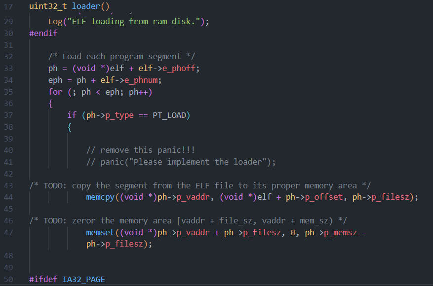
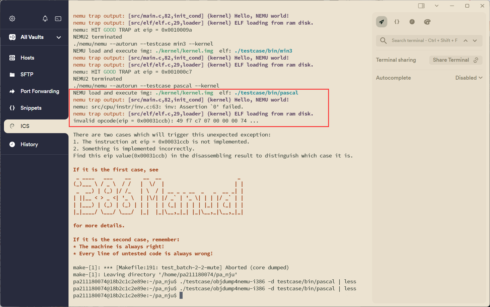
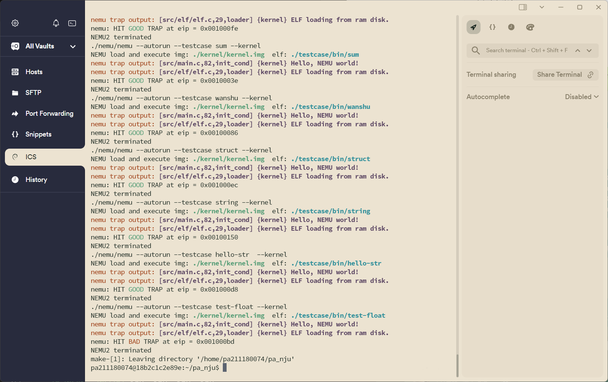

# PA2-2 实验报告

211180074 彭安澜

2024 年 4 月 16 日

## 实验代码及重点问题

### 修改 `testcase/Makefile`中 `LDFLAGS`

在 `pa_nju`下使用指令 `vim testcase/Makefile `，在打开的界面中注释掉开始地址为0x30000的语句，取消对开始地址为0x100000的语句的注释即可

然后执行 `make clean`。

### 实现Kernel中的 `loader()`

按照课上讲述内容，直接使用标准库函数 `memcpy`和 `memset`，一句即可实现一个功能。

### 执行测试案例并通过

执行 `make test_pa-2-2`命令，运行到pascal测试案例出现未完成定义的指令：

从0x30000+的地址可以看出，此时应该是内核中出现未见过的指令，使用 `./testcase/objdump4nemu-i386 -d testcase/bin/pascal | less`查看pascal的反汇编结果是找不到这个指令的；此时若尝试在kernel下反汇编几个.o文件，也无果：`./testcase/objdump4nemu-i386 -d kernel/src/main.o | less`以及 `./testcase/objdump4nemu-i386 -d kernel/src/elf/elf.o | less`。

但是给出了指令码，所以对照查表也能解决，观察发现只是实现dec指令填表时，漏填了 `dec_r_v`的指令，填写完成即可运行：

填写完成后一切顺利运行。

# 运行结果

除了test-float，其他都是HIT GOOD TRAP，不过eip显示和ppt中还略有差别，猜测也还是代码版本的问题。

# 实验思考题

1. **为什么在装载时要把内存中剩余的 `p_memsz - p_filesz`字节的内容清零?**

   根据课上讲解内容，当 `p_memsz - p_filesz`出现不为0的情况（通常只会出现大于0的情况，若小于0，则内存中有些地址要被反复写入，这是不太合理的），通常是有未初始化的全局变量导致的——未初始化的变量，elf文件中不必要预留空间来存它们的值，但当程序运行起来时，就需要为这些变量分配空间，因为后续它们的值会被写入或读取；换句话说 `p_memsz - p_filesz`字节实际上就是elf文件的.bss节，用来存取未初始化的变量。

   将这些内容清零，则是出于一种安全的考虑；虽然变量声明完一定要初始化后再调用，这是一个编程的基本好习惯，但如果真的出现了调用未初始化的变量的情况，为了避免出现不可预测的未定义情况，把内存中剩余的 `p_memsz - p_filesz` 字节的内容清零就提供了一种安全措施，从而可以确保程序的稳定运行。
