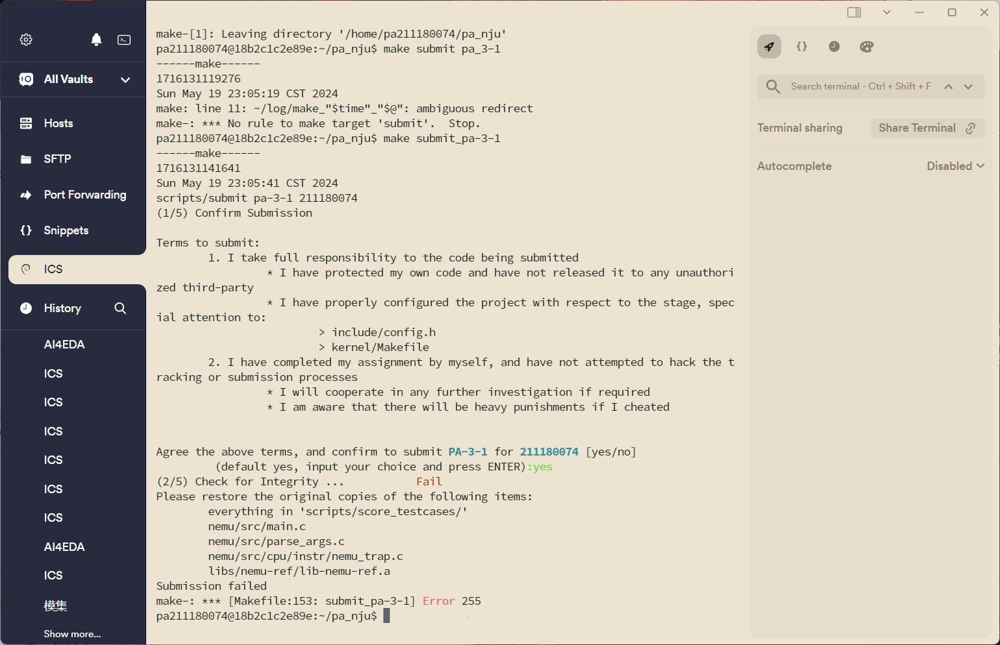
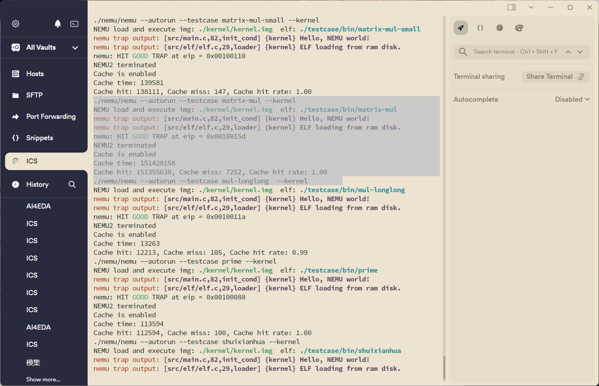
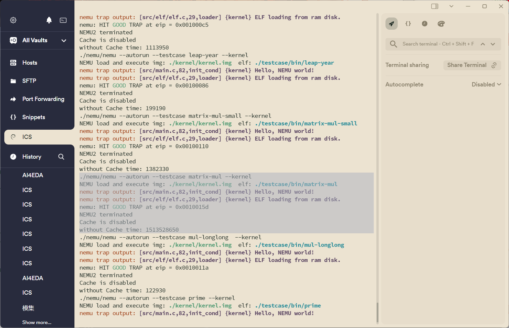
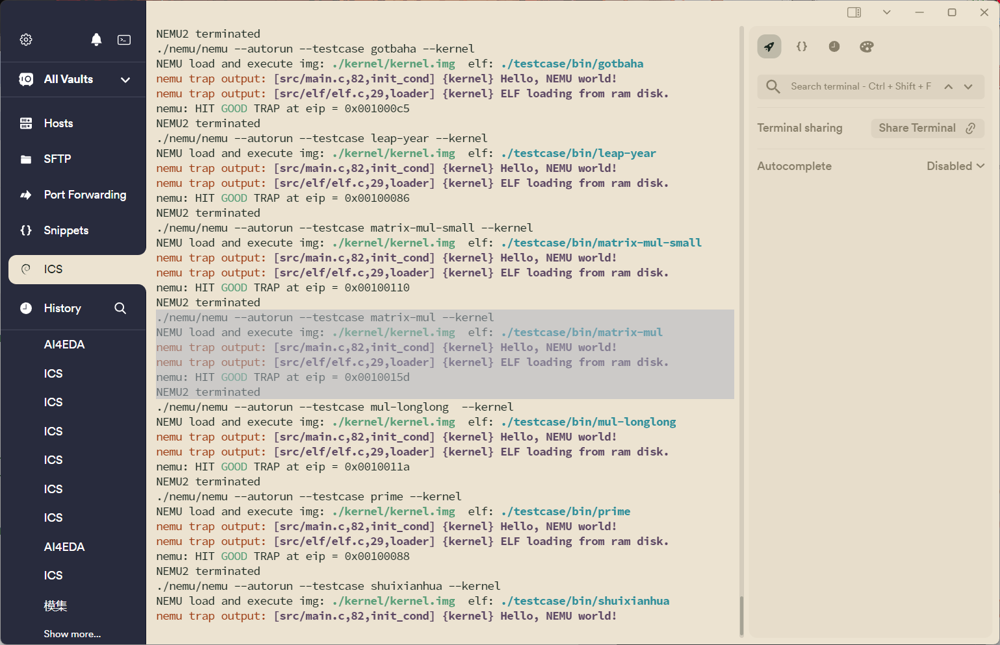
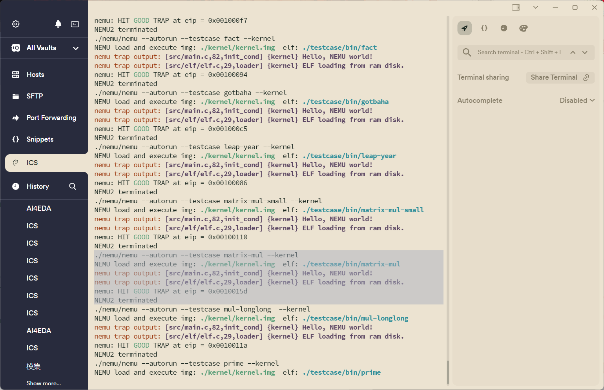

# PA3-1 实验报告

211180074 彭安澜

2024 年 5 月 20 日

## 实验代码及重点问题

### 物理地址和CacheLine的组成

根据代码一个Block为64B，Cache整个存储空间为64KB，8路组相连的提示信息，我们可以得到物理地址和CacheLine的组织形式：

```
Physical Address:  
31                                  12                5                 0
╔═══════════════════════════════════╬═════════════════╪═════════════════╗
║               tag                        group            offset      ║
╚═══════════════════════════════════╬═════════════════╪═════════════════╝
```

物理地址的高19位为标记位，中7位为组号（对应组数有1024/8=128），低6位为块内偏移量（块内地址）。

```
CacheLine:
group = (0 - 127)
 1 bit               19 bit                     64 * 8 bit
╔═══════╬═══════════════════════════╬══════════════════════════════ ... ╗
║ valid             tag                        data[64]                 ║ index = 0
╚═══════╬═══════════════════════════╬══════════════════════════════ ... ╝ 
...
...
...
 1 bit               19 bit                      64 * 8 bit
╔═══════╬═══════════════════════════╬══════════════════════════════ ... ╗
║ valid             tag                        data[64]                 ║ index = 7
╚═══════╬═══════════════════════════╬══════════════════════════════ ... ╝ 

```

Cache总共有1024行，其中每8行（index从0到7）构成一组，每组有自己的组号（group从0到127）。

每次查找Cache，只要读取物理地址的group的内容，就可以到对应组号的Cache组进行检索，将物理地址中tag的内容，与组内总共8个Cache行的tag值依次进行比较，如果成功找到，就可以再根据物理地址中的偏移量，在Cache相同偏移位置处找到目标数据。

最后给出如下宏定义，代码全部使用宏构建，有良好的可重构性：

```c
// 1024行，每行64B，总共64KB
// 128组，每组8行
#define CACHE_SIZE_B 64 * 1024
#define CACHE_SIZE_LINE 1024
#define CACHE_SIZE_GROUP 128
#define CACHE_LINE_SIZE 64
#define CACHE_GROUP_SIZE 8

#define TAG_LEN 19
#define GROUP_LEN 7
#define OFFSET_LEN 6

// define the structure of cache
typedef struct {
    bool valid; // 理论1bit 
    uint32_t tag;   // 理论19bit
    uint8_t data[CACHE_LINE_SIZE];  // 64B
} CacheLine;
```

### `cache_read()/cache_write()`实现思路

在处理读和写cache的过程中，基本只要按照课件给出的流程完成即可，唯一的难点在跨块的处理：此处的设计思想是，函数执行一开始就判断是否会发生跨块现象，如果跨块，就在两个块内各自递归调用 `cache_read()/cache_write()`函数进行非跨块的读写cache操作，并将返回结果合并作为最终结果反馈；如此操作，后续则只要考虑不跨块的情况即可，具体代码如下。

注：

* 还编写了 `check_cache()`（check and return the index of the block in the group）、`find_empty_line()`（find an empty line in the group of cache）函数辅助相关功能的实现
* 特别要注意从内存中读取一整块到Cache中的过程，一方面是对nemu虚拟主存的读取只能调用接口 `hw_mem_read()`而不能直接使用 `memcpy`函数，并且 `hw_mem_read()`一次最多读取4bit，因此还需要循环读取

```c
// read data from cache
uint32_t cache_read(paddr_t paddr, size_t len)
{
	// 返回值最多为4字节，规范len长度
	if (len<0 || len>4)
	{
		printf("Error: wrong len\n");
		return 0;
	}
	if (len == 0)
	{
		return 0;
	}

	// implement me in PA 3-1
	// 从虚拟地址解析出TAG_LEN位的tag，GROUP_LEN位的group，OFFSET_LEN位的offset
	uint32_t tag = paddr >> (32 - TAG_LEN);
	uint32_t group = (paddr << TAG_LEN) >> (32 - GROUP_LEN);
	uint32_t offset = (paddr << (TAG_LEN + GROUP_LEN)) >> (32 - OFFSET_LEN);
	uint32_t ret = 0;

	// 检查是否跨块，跨块则拆分后递归调用
	if(offset + len - 1 >= CACHE_LINE_SIZE)
	{
		// 低地址部分
		ret = cache_read(paddr, CACHE_LINE_SIZE - offset);
		// 高地址部分
		ret = ret | (cache_read(paddr + CACHE_LINE_SIZE - offset, len - (CACHE_LINE_SIZE - offset)) << ((CACHE_LINE_SIZE - offset) * 8));
		// CACHE_LINE_SIZE - offset 是低地址部分的长度
		return ret;
	}
	else
	{

		// 在组内查找
		int8_t index = check_cache(paddr);
		// hit
		if (index != -1)
		{
#ifdef CACHE_TIMER
			cache_time += 1;
			cache_hit += 1;
#endif
			// 从cache中读取数据
			memcpy(&ret, cache[group * CACHE_GROUP_SIZE + index].data + offset, len);

			return ret;
		}
		// miss
		else
		{
#ifdef CACHE_TIMER
			cache_time += 10;
			cache_miss += 1;
#endif
			// 从内存中读取数据
			// 不能用paddr_read，因为paddr_read会调用cache_read！
			ret = hw_mem_read(paddr, len);
			// 将对应的整个块数据写入cache
			index = find_empty_line(paddr);
			if (index != -1)
			{
				// 有空行
				cache[group * CACHE_GROUP_SIZE + index].valid = true;
				cache[group * CACHE_GROUP_SIZE + index].tag = tag;
				// 将整个块数据写入cache
				// 从内存中读数据不能直接用memcpy，因为paddr不是本机对应地址，要用hw_mem_read
				// hw_mem_read一次最多读4字节，所以要循环读取
				for(int i = 0; i < CACHE_LINE_SIZE; i=i+4)
				{
					uint32_t result = hw_mem_read((paddr >> OFFSET_LEN << OFFSET_LEN) + i, 4);
					memcpy(cache[group * CACHE_GROUP_SIZE + index].data + i, &result, 4);
				}

			}
			else
			{
				// 没有空行，随机替换
				index = (uint8_t)rand() % CACHE_GROUP_SIZE;
				cache[group * CACHE_GROUP_SIZE + index].valid = true;
				cache[group * CACHE_GROUP_SIZE + index].tag = tag;
				// 将整个块数据写入cache
				for(int i = 0; i < CACHE_LINE_SIZE; i=i+4)
				{
					uint32_t result = hw_mem_read((paddr >> OFFSET_LEN << OFFSET_LEN) + i, 4);
					memcpy(cache[group * CACHE_GROUP_SIZE + index].data + i, &result, 4);
				}
			}
			return ret;
		}
	}

	return 0;
}

// write data to cache
void cache_write(paddr_t paddr, size_t len, uint32_t data)
{
	// implement me in PA 3-1
	// 从虚拟地址解析出TAG_LEN位的tag，GROUP_LEN位的group，OFFSET_LEN位的offset
	// uint32_t tag = paddr >> (32 - TAG_LEN); // unused
	uint32_t group = (paddr << TAG_LEN) >> (32 - GROUP_LEN);
	uint32_t offset = (paddr << (TAG_LEN + GROUP_LEN)) >> (32 - OFFSET_LEN);

	// 检查是否跨块，跨块则拆分后递归调用
	if(offset + len - 1 >= CACHE_LINE_SIZE)
	{
		// 低地址部分
		cache_write(paddr, CACHE_LINE_SIZE - offset, data & ((1 << ((CACHE_LINE_SIZE - offset) * 8)) - 1));
		// 高地址部分
		cache_write(paddr + CACHE_LINE_SIZE - offset, len - (CACHE_LINE_SIZE - offset), data >> ((CACHE_LINE_SIZE - offset) * 8));
		return;
	}
	else
	{
		// 在组内查找
		int8_t index = check_cache(paddr);
		// hit
		if (index != -1)
		{
			// 写入cache
			memcpy(cache[group * CACHE_GROUP_SIZE + index].data + offset, &data, len);
			// 写入内存
			hw_mem_write(paddr, len, data);
			return;
		}
		// miss
		else
		{
			// not write allocate
			// 直接写入内存
			hw_mem_write(paddr, len, data);
			return;
		}
	}

}
```

### `CACHE_TIMER`宏的使用

实验中还定义了 `CACHE_TIMER` 宏，用来模拟Cache和主存访问的速度差异；考虑到使用的是全写法+非写分配法，Cache对写操作没有加速效果，所以模拟只针对读操作进行。当定义了 `CACHE_TIMER` 宏的时候，会在读Cache成功命中时，为全局变量 `cache_time`加1，反之Cache未能命中或根本没有启动Cache时，每次从主存读取内容会为全局变量 `cache_time`加10。

需要特别说明的是，启用模拟计时功能，涉及到更改main.c文件，这会导致 `make submit_pa-3-1`时，代码无法通过完整性检验，因此最后提交的代码中，将相关内容写到了注释中：

```c
#define CACHE_TIMER         // cache timer is enabled (to time the execution time of with and without cache)


note: 
if you want to enable cache timer, you need to add the following code in nemu/src/main.c. 
Howerver, if you change the code in nemu/src/main.c, you will not be able to use the command make submit_pa-3-1 to submit your code, because the integrity of the code will be checked. 
You have to restore the code in nemu/src/main.c to the original code before you submit your code.

add this at the beginning of the file nemu/src/main.c:
```c
#ifdef CACHE_TIMER
extern uint64_t cache_time;
extern uint64_t cache_hit;
extern uint64_t cache_miss;
#endif


add this at the end of the function `main` (before `return 0;`) in the file nemu/src/main.c:

```c
#ifdef CACHE_TIMER

#ifdef CACHE_ENABLED
    printf("Cache is enabled\n");
    printf("Cache time: %lld\n", cache_time);
    printf("Cache hit: %lld, Cache miss: %lld, Cache hit rate: %.2f\n", cache_hit, cache_miss, (double)cache_hit / (cache_hit + cache_miss));
#else
    printf("Cache is disabled\n");
    printf("without Cache time: %lld\n", cache_time);
#endif

#endif

```

修改main.c导致提交时的报错



## 运行结果

在开启Cache和Cache计时器时（`CACHE_ENABLED on; CACHE_TIMER on`），得到以下结果，可以看到每个测试案例执行完，都会打印模拟运行时间、命中数、未命中数、命中率等参数：



而在关闭Cache但开启Cache计时器时（`CACHE_ENABLED on; CACHE_TIMER on`），得到以下结果，可以看到每个测试案例执行完都会打印模拟执行时间：



挑选执行时间最长的矩阵乘法案例进行比较分析，首先从图1我们看到Cache的命中率很高（保留两位小数则为1），则可以猜想有Cache时程序的模拟运行时间应该正好是没有Cache时的1/10；然后从图2中看到，没有Cache时的模拟运行时间几乎就是有Cache时的10倍（数字都是15开头，但图2有10位，而图1只有9位）。由此说明，我们的Cache确实极大优化了系统性能。

最后为了确保代码正确性，还测试了关闭Cache和Cache计时器的情况（`CACHE_ENABLED off; CACHE_TIMER off`）：



以及开启Cache但关闭Cache计时器（`CACHE_ENABLED on; CACHE_TIMER off`）的情况；这个模式将是正式版以及后续PA中一直使用的模式。


