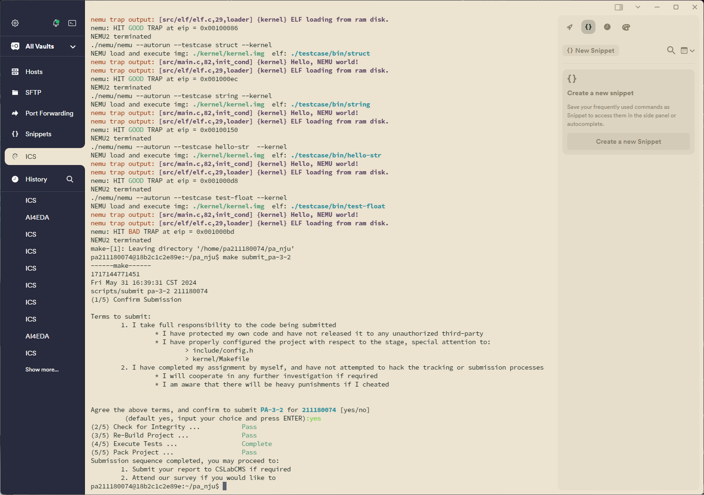
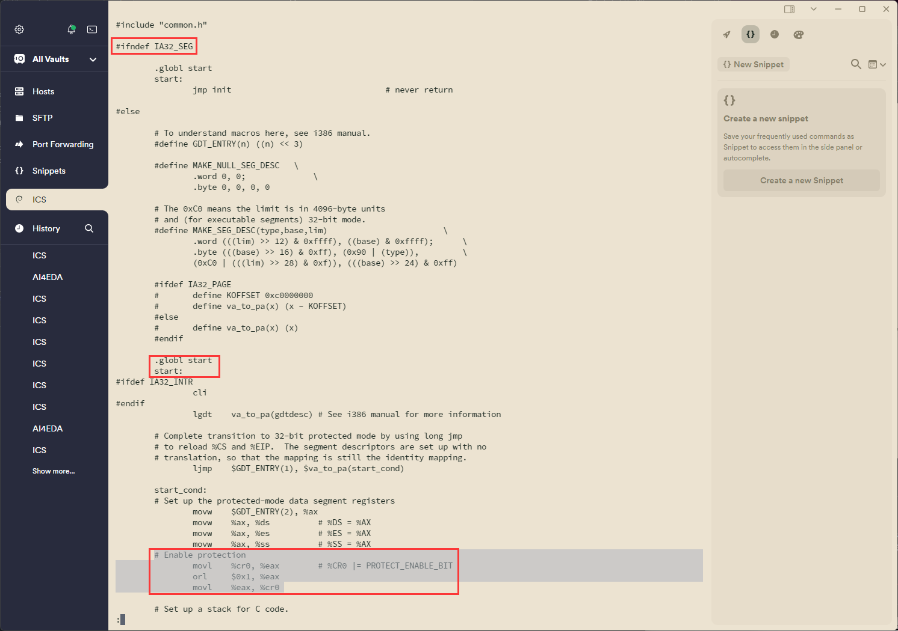

# PA3-2 实验报告

211180074 彭安澜

2024 年 5 月 31 日

## 实验代码及重点问题

本次实验中主要完成了一下内容的代码：

1. 在 `include/config.h`头文件中添加宏定义 `IA32_SEG`以启用分段功能；
2. 在 `CPU_STATE`中添加对 `GDTR`、`CR0`的模拟以及在 `init_cpu()`中进行初始化为0；在 `CPU_STATE`中添加对6个段寄存器的模拟在 `init_cpu()`中进行初始化为0，注意除了要模拟其16位的可见部分，还要模拟其隐藏部分，顺序不能有错；
3. **实现包括 `lgdt`、针对控制寄存器和段寄存器的特殊 `mov`以及 `ljmp`指令；**
4. **实现 `segment_translate()`、`loag_sreg()`函数，并在 `vaddr_read()`和 `vaddr_write()`函数**中添加保护模式下的虚拟地址向线性地址转换的过程；
5. 修改之前的代码，主要是未用宏实现的指令，需要对操作数的类型和对应的段寄存器做出修正。

下面对这五步依次进行讲解

### Step1 & 2

前两步的代码在原来的版本中已经写好或者在教程中已经给出正确的实现，此处不再赘述。

### Step3

实验中重点完成的步骤，下面对重点问题进行说明

#### lgdt指令的实现

按照i386手册完成即可，行为就是读取m类型的六个字节的数据，存到GDTR中，但有一些注意事项：

1. 使用 `modrm_rm`对操作数解码后，不能调用 `operand_read`对数据进行读取，这主要涉及下面两个问题；
2. 首先在GDTR还未完成初始化时，段功能还不能正常启动，此时处于实模式，不能用虚拟地址读取内存，必须用 `laddr_read`替代 `operand_read`完成对GDTR内容的访问，`laddr_read`的实参来自 `modrm_rm`解码出的操作数 `.addr`；
3. 其次在lgdt指令中，总共需要读取6个字节的内容，其中低地址2字节为GDTR的limit内容（这里要特备注意！因为手册中写的是m16:24/32，容易造成低地址为base，高地址为limit的错误印象，这一点我们在后面会再讨论），高地址3或4字节为base内容。

#### 特殊mov指令的实现

按照i386主要涉及下列三条指令的实现mov_c2r_l（0x0f 20）、mov_r2c_l（0x0f 22）、mov_rm2s_w（0x8e /r，这条指令在手册中的操作码被错误地写成了0x8d）

1. 在mov_c2r_l和mov_r2c_l两个函数中，因为涉及CREG类型的数据，可能不能用modrm_r_rm解码，需要手动解码，以mov_c2r_l为例子

   ```c
   // 0x0f 20
   // mov cr0, r32
   make_instr_func(mov_c2r_l) {
           int len = 1;
           OPERAND cr0, r32;
           cr0.data_size = 32;
           r32.data_size = 32;

           // 这里因为CREG比较特殊，所以不能用modrm_r_rm，需要手动解码
           MODRM modrm;
           modrm.val = instr_fetch(eip + 1, 1);
           len += 1;

           cr0.addr = modrm.reg_opcode;
           cr0.type = OPR_CREG;
           cr0.sreg = SREG_CS;
           operand_read(&cr0);

           r32.addr = modrm.rm;
           r32.type = OPR_REG;
           r32.sreg = SREG_CS;
           r32.val = cr0.val;
           operand_write(&r32);

           print_asm_2("mov", "crX", len, &r32, &cr0);
           return len;
   }
   ```
2. mov_rm2s_w正常解码，正常读数，正常写数即可，但注意到因为涉及了段寄存器的赋值，因此一定还有更新段寄存器cache值的操作 `load_sreg(sreg.addr);`需要记得完成。

#### ljump指令的实现

ljmp指令实际上是jump far指令（Opcode为EA），在这条指令中，CS段寄存器和EIP寄存器都要被更新，注意更新CS寄存器时，同样也要同步调用 `load_sreg`函数对寄存器的cache值（CS寄存器隐藏内容）进行更新。

除此之外，对这条指令还要注意到ptr16:16/32 jump far，看似先读ptr16（段选择子）再读ptr16/32（eip），但实际上按照小端序，ptr16是高位，ptr32是低位，所以ptr16在高地址，ptr32在低地址，先读取的一定是ptr32也就是offset=eip，然后才是段选择子seg，这和前面的lgdt指令是相反的。

### Step4

前两个函数的实现没有什么特别的，但是建议尽可能加入多的assert，对base==0，limit==0xfffff，granularity==1等扁平模式下特有的情况进行检验，虽然在真实计算机系统中，不会出现这种情况，但在nemu中，上述判断语句就是始终成立的，加入这些判断有助于对代码debug。

然后是对vaddr下内存读写函数进行更新，注意这里除了有#ifdef外，还一定要有对保护模式的检验，而不是统统都用segment_translate进行转换，否则在系统初始化时，就会因为段表还未初始化，limit还是0，导致对虚拟地址offset对limit的溢出判断成立，程序异常结束。

### Step5

这一部分可做可不做，而且几乎不能观察到报错信息，因为我们采用的是扁平模式，外加上在segment.c里直接加入了对颗粒度，limit，base等的强制检查，所以事实上并没有真正意义上分段；程序中有些bug可能是存在的，即使测试能够正常通过。

## 运行结果

通过全部测试案例，并完成提交：



## 思考题

1. NEMU在什么时候进入了保护模式？

   通常，在计算机启动时，CPU首先处于实模式（Real Mode），这是一种向后兼容8086处理器的模式，只能直接访问1MB的内存。操作系统启动并完成一系列初始化后，为了使用更多的内存和执行高级的内存管理和保护功能，系统会将CPU切换到保护模式，这一过程的标志是CR0寄存器的PE位被置为1。

   具体到nemu的行为，我们可以在下面路径中查看内核的启动程序 `~/pa_nju/kernel/start$ less start.s`，可以看到，在定义了相关宏的情况下，在完成对DS、ES、SS的段寄存器的初始化后，就将修改CR0的PE位，启动保护模式：

   
2. 在GDTR中保存的**段表首地址是虚拟地址、线性地址、还是物理地址？为什么？**

   全局描述符表寄存器（Global Descriptor Table Register，简称GDTR）用于存储全局描述符表（Global Descriptor Table，简称GDT）的位置和大小。GDTR中保存的是全局描述符表的**线性地址**和表的界限（即长度减1）。

   在保护模式下，CPU通过分段机制将虚拟地址（段内地址）转换成线性地址，然后可能通过分页机制将线性地址转换为物理地址。GDTR需要指向一个在内存中实际可访问的地址，这个地址是在分页之前的地址，也就是线性地址。

   如果采用虚拟地址，则虚拟地址转换为实际可用的物理地址前，先要根据段寄存器给出的index在GDT中找到对应的段描述符从而找到段基址，而GDT的首址就存放在GDTR中；而如果GDTR也是虚拟地址，则获取GDT的首址然后访问GDT就要重复上述步骤；最后就陷入了寻找GDT真正地址的死循环中，因为找GDT需要转换虚拟地址，而转换虚拟地址又必须先找到GDT。

   如果采用物理地址，首先在保护模式下，直接使用物理地址是不可行的，因为所有内存访问需要通过段和页表的转换；此外，物理地址的使用会绕过内存保护机制，降低系统的安全性和灵活性。

   综上所述，GDTR保存的必须是线性地址。
