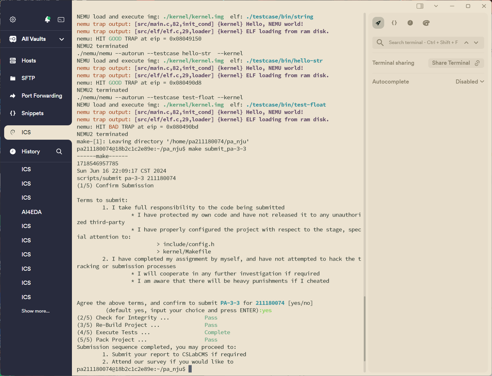
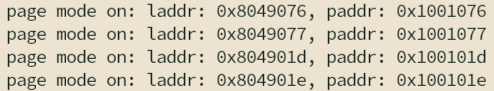

# PA3-3 实验报告

211180074 彭安澜

2024 年 6 月 16 日

## 实验代码及重点问题

本次实验中主要完成了一下内容的代码：

* 修改Kernel和testcase中 `Makefile`的链接选项；
* 在 `include/config.h`头文件中定义宏 `IA32_PAGE`并 `make clean`；
* 在 `CPU_STATE`中添加 `CR3`寄存器；
* 修改 `laddr_read()`和 `laddr_write()`，适时调用 `page_translate()`函数进行地址翻译；
* 修改Kernel的 `loader()`，使用 `mm_malloc`来完成对用户进程空间的分配；
* 通过 `make test_pa-3-3`执行并通过各测试用例。

其中需要特别说明的部分如下：

* 在 `laddr_read()`和 `laddr_write()`中需要特别处理跨页访问的情况，以 `laddr_read()`为例，代码如下：

  ```c
  uint32_t laddr_read(laddr_t laddr, size_t len)
  {
  #ifdef IA32_PAGE
  	assert(len == 1 || len == 2 || len == 4);
  	if(cpu.cr0.pg == 1 && cpu.cr0.pe == 1){
  		// 跨页访问，高20位不同
  		if( laddr >> 12 != (laddr + len - 1) >> 12 ){
  			// 读取的数据跨页
  			uint32_t data = 0;
  			uint32_t len1 = (((laddr >> 12) + 1) << 12) - laddr;
  			uint32_t len2 = len - len1;
  			paddr_t paddr1 = page_translate(laddr);
  			paddr_t paddr2 = page_translate(laddr + len1);
  			data = paddr_read(paddr1, len1);
  			data |= paddr_read(paddr2, len2) << (len1 << 3);
  			return data;
  		}
  		else{
  			// 使用paddr应该比课件中的hwaddr要好，因为还可以引入cache
  			paddr_t paddr = page_translate(laddr);
  			return paddr_read(paddr, len);
  		}
  	}
  	// 实模式下
  	else{
  		return paddr_read(laddr, len);
  	}
  #else
  	return paddr_read(laddr, len);
  #endif
  }
  ```

  有一些注意事项：

  * 在PPT中，对物理地址的进一步处理，采用的是 `hw_mem_read()`函数，但个人认为使用 `paddr_read()`函数会更好，因为在这一函数中加入了Cache的调用；
  * 跨页访问有可能涉及到读取三字节的问题（例如恰好从一页的最后一个字节（考虑到可以读取单字节，这种情况完全可能发生）开始读取四个字节），需要注意下层读取函数可能不能用assert限制只能读取1/2/4个字节。
* 编写 `page_translate()`函数时，注意对present位的检查，nemu默认不会出现缺页情况，以此可以判断相关函数编写是否有误。
* 修改Kernel的 `loader()`，使用 `mm_malloc`来完成对用户进程空间的分配，这部分的代码修改位置就在之前pa作业中编写的装载部分的代码附近，如下：

  ```c
  uint32_t loader()
  {
  	Elf32_Ehdr *elf;
  	Elf32_Phdr *ph, *eph;
  #ifdef HAS_DEVICE_IDE
  	uint8_t buf[4096];
  	ide_read(buf, ELF_OFFSET_IN_DISK, 4096);
  	elf = (void *)buf;
  	Log("ELF loading from hard disk.");
  #else
  	elf = (void *)0x0;
  	Log("ELF loading from ram disk.");
  #endif
  	/* Load each program segment */
  	ph = (void *)elf + elf->e_phoff;
  	eph = ph + elf->e_phnum;
  	for (; ph < eph; ph++)
  	{
  		if (ph->p_type == PT_LOAD)
  		{

  			// remove this panic!!!
  			// panic("Please implement the loader");
  #ifdef IA32_PAGE
  			uint32_t vaddr = mm_malloc(ph->p_vaddr, ph->p_memsz);
  			memcpy((void *)vaddr, (void *)elf + ph->p_offset, ph->p_filesz);
  			memset((void *)vaddr + ph->p_filesz, 0, ph->p_memsz - ph->p_filesz);
  #else
  /* TODO: copy the segment from the ELF file to its proper memory area */
  			memcpy((void *)ph->p_vaddr, (void *)elf + ph->p_offset, ph->p_filesz);

  /* TODO: zeror the memory area [vaddr + file_sz, vaddr + mem_sz) */
  			memset((void *)ph->p_vaddr + ph->p_filesz, 0, ph->p_memsz - ph->p_filesz);
  #endif

  #ifdef IA32_PAGE
  			/* Record the program break for future use */
  			extern uint32_t brk;
  			uint32_t new_brk = ph->p_vaddr + ph->p_memsz - 1;
  			if (brk < new_brk)
  			{
  				brk = new_brk;
  			}
  #endif
  		}
  	}
  	volatile uint32_t entry = elf->e_entry;
  #ifdef IA32_PAGE
  	mm_malloc(KOFFSET - STACK_SIZE, STACK_SIZE);
  #ifdef HAS_DEVICE_VGA
  	create_video_mapping();
  #endif
  	write_cr3(get_ucr3());
  #endif
  	return entry;
  }
  ```

## 运行结果

执行 `make test_pa-3-3`，通过全部测试案例，并完成提交：



## 思考题

1. Kernel的虚拟页和物理页的映射关系是什么？请画图说明；

   根据PA2-2中内容可知物理地址的分配关系；同时又从代码中可知，Kernel的虚拟地址从 `0xc0030000`开始（Linux的标准），则映射关系如下：（虽然一般内核空间从 `0xc0000000`开始，但为了和物理地址简单对齐，又增加了 `0x30000`的偏置）

   ```
   Physical Address  
   0x0                    0x30000             0x100000  
   +------------------+---+---------------+---+----------------+---------+
   |Testcase ELF File | ~ | Kernel Binary | ~ |Testcase Binary |    ~    |
   +------------------+---+---------------+---+----------------+---------+
                          |__________     |____________
                                     |                 |
   Virtual Address                   v                 v  
   0x0                  0xc0000000   0xc0030000  
   +-----+----------+---+------------+-----------------+-----+
   |  ~  |User Space| ~ |      ~     |   Kernel Space  |  ~  |
   +-----+----------+---+------------+-----------------+-----+

   ```
2. 以某一个测试用例为例，画图说明用户进程的虚拟页和物理页间映射关系又是怎样的？Kernel映射为哪一段？你可以在 `loader()`中通过 `Log()`输出 `mm_malloc`的结果来查看映射关系，并结合 `init_mm()`中的代码绘出内核映射关系。

   同样按照Linux的标准，用户空间（测试用例）的只读数据和代码段从虚拟地址 `0x8048000`以上开始；而物理地址测试用例则是从 `0x100000`开始：

   

   则用户进程和内核关于物理内存映射管辖如下：

   ```
   Physical Address  
   0x0                    0x30000             0x100000  
   +------------------+---+---------------+---+----------------+---------+
   |Testcase ELF File | ~ | Kernel Binary | ~ |Testcase Binary |    ~    |
   +------------------+---+---------------+---+----------------+---------+
                          |___________    |___|__________      |
   Virtual Address       ______________|______|__________|_____|
             ___________|              |                 |
             v                         v                 v
   0x0       0x804800     0xc0000000   0xc0030000  
   +-----+---+--------+---+------------+-----------------+-----+
   |  ~  | User Space | ~ |      ~     |   Kernel Space  |  ~  |
   +-----+---+--------+---+------------+-----------------+-----+

   ```
3. 在Kernel完成页表初始化前，程序无法访问全局变量”这一表述是否正确？在 `init_page()`里面我们对全局变量进行了怎样的处理？

   这一表述是正确的，在初始化页表前，全局变量地址以虚拟地址给出，在Kernel完成页表初始化前，无法进行虚拟地址到物理地址的转换，也就不能从内存地址读出存放在磁盘上ELF文件内的全局变量信息。

   在 `init_page()`里面对全局变量进行了初始化，将其页面加入到物理内存中，并修改页表，将有效位标记为有效。
