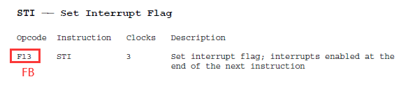
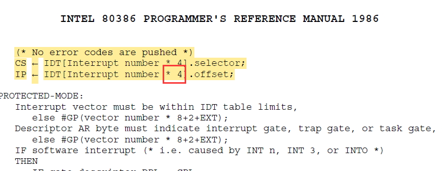
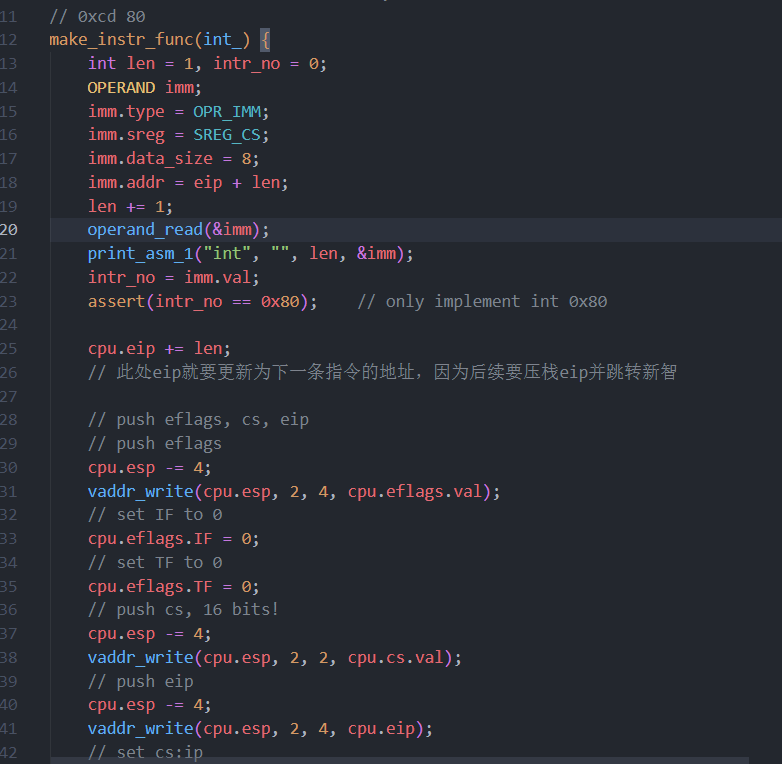
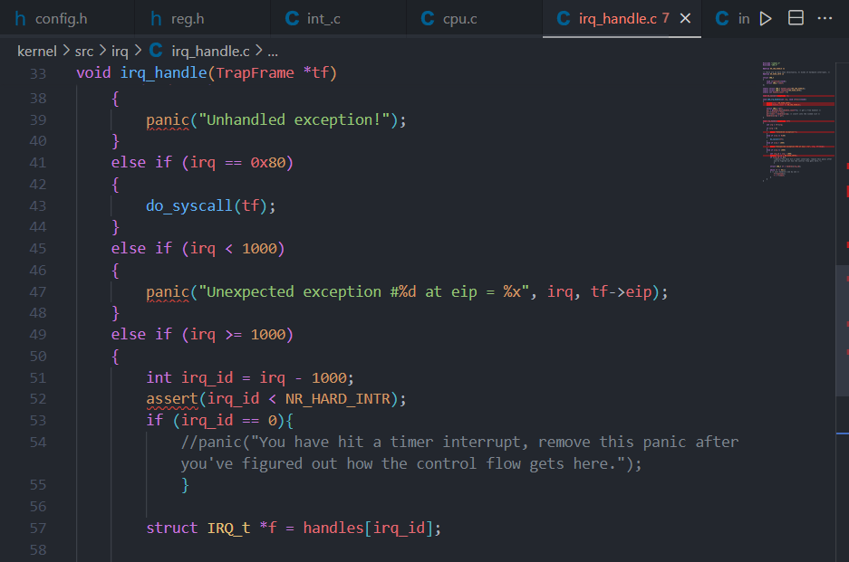
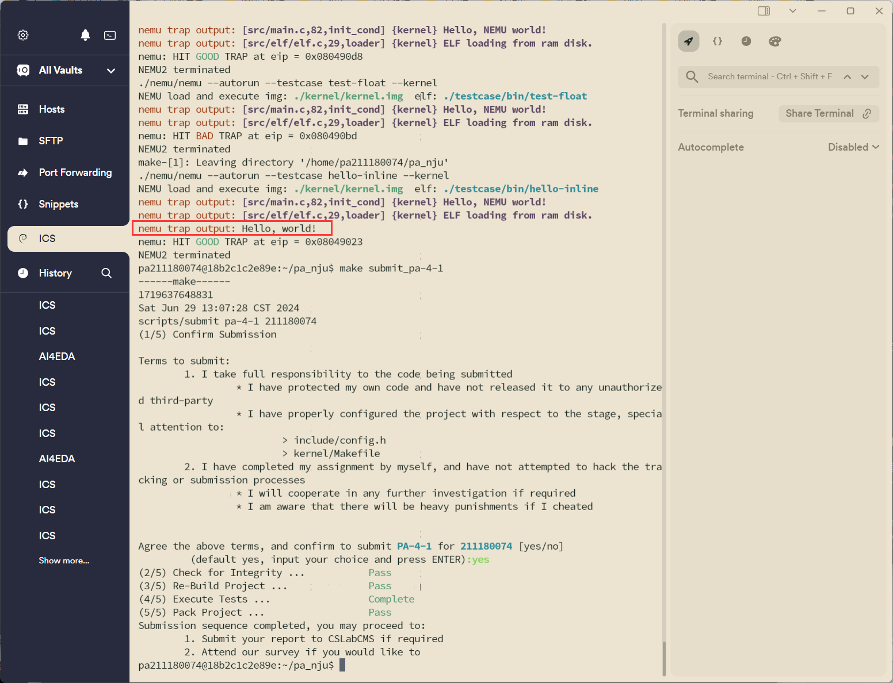

# PA4-1 实验报告

211180074 彭安澜

2024 年 6 月 29 日

## 实验代码及重点问题

本次实验中主要完成了一下内容的代码：

### （1）通过自陷实现系统调用

1. 在 `include/config.h`中定义宏 `IA32_INTR`并 `make clean`；
2. 在 `nemu/include/cpu/reg.h`中定义 `IDTR`结构体，并在 `CPU_STATE`中添加 `idtr`；
3. 实现包括 `lidt`、`cli`、`sti`、`int`、`pusha`、`popa`、`iret`等指令；
4. 在 `nemu/src/cpu/intr.c`中实现 `raise_intr()`函数;
5. 执行 `hello-inline`测试用例, 或执行 `make test_pa-4-1`命令并看到屏幕输出

其中需要特别说明的部分如下：

* idtr的结构在课件中没有明确说明，但实际上和gdtr非常像，由16位的limit和32位的基址组成；类似的还有lidt和lgdt的行为基本一致，代码也大体相同，而且要注意都是对线性地址进行操作，可能无法直接使用 `operand_write()`的封装函数。

  ```c
  // define the structure of IDTR
  // similar to GDTR
  typedef struct{
  	uint32_t limit : 16;
  	uint32_t base : 32;
  } IDTR;
  ```
* `sti`在实现时要注意到手册上有错。

  
* `int_`实现时也要注意到手册上可能有错：

  

  （此处的中断号应该不用*4，按照idtr中的基址加上中断号×8（一条表项有8个字节）就可以得到表项的首地址，然后使用 `laddr_read()`函数读取表项中内容即可）

  

  （int_有一些手册没提到的细节也必须要注意，包括压栈的eip必须是下一条指令，因此提前就要更新eip；然后return返回的值是0，因为eip已经发生跳转）

### （2）响应时钟中断

1. 在 `include/config.h`中定义宏 `HAS_DEVICE_TIMER`并 `make clean`；
2. 在 `nemu/include/cpu/reg.h`的 `CPU_STATE`中添加 `uint8_t intr`成员，模拟中断引脚；
3. 在 `nemu/src/cpu/cpu.c`的 `init_cpu()`中初始化 `cpu.intr = 0`；
4. 在 `nemu/src/cpu/cpu.c`的 `exec()`函数 `while`循环体，每次执行完一条指令后调用 `do_intr()`函数查看并处理中断事件；
5. 执行 `make test_pa-4-1`；
6. 触发Kernel中的 `panic`，找到该 `panic`并移除。

在 `kernel\src\irq\irq_handle.c`就可以找到panic代码，注释掉即可。



## 运行结果

执行 `make test_pa-4-1`，通过全部测试案例，并完成提交：



## 思考题

1. 详细描述从测试用例中的 `int $0x80` 开始一直到 `HIT_GOOD_TRAP`为止的详细的系统行为（完整描述控制的转移过程，即相关函数的调用和关键参数传递过程），可以通过文字或画图的方式来完成；

   * 当执行到 `int $0x80` 指令时，会转到为该操作码编写的 `int_` 函数中去执行，在 `int_` 函数中，先从指令的操作数中读取到中断码，为 `$0x80` ，然后根据操作码读取IDT对应的表项，并更新eip和cs的值，此时程序流发生跳转。
   * 跳转的目的地在idt.c中初始化IDT表时就被设定：

     ```c
     /* the system call 0x80 */
     set_trap(idt + 0x80, SEG_KERNEL_CODE << 3, (uint32_t)vecsys, DPL_USER);
     ```
     `vecsys` 函数会进一步指向do_irq.S的 `asm_do_irq` 函数（该函数先完成error code和irq的压栈），这个函数保护现场，然后调用 `irq_handle()` 函数：

     ```assembly
     # The follow code is *VERY* important for interrupts and exceptions handling.
     # You should make yourself understand it clearly.
     asm_do_irq:
     	pushal

     	pushl %esp		# 处理异常/中断（系统调用参数在通用寄存器中）
     	call irq_handle

     	addl $4, %esp
     	popal
     	addl $8, %esp
     	iret
     ```
   * 转到 `irq_handle()` 函数后，根据系统调用号执行相应的函数，完成系统调用。
   * 完成系统调用后回到 `asm_do_irq ` 函数中继续执行，通过 `popal` 指令恢复现场，并通过 `iret` 指令返回原来的程序流继续执行。
2. 在描述过程中，回答 `kernel/src/irq/do_irq.S`中的 `push %esp`起什么作用，画出在 `call irq_handle`之前，系统栈的内容和 `esp`的位置，指出 `TrapFrame`对应系统栈的哪一段内容。

   * `push %esp`的作用：保存当前栈顶指针，这样可以保存当前堆栈上下文，并传递参数（因为下一步就转到 `irq_handle` 函数中执行）；这样在 `irq_handle` 函数中，可以通过访问压入堆栈的 `%esp` 的值来做进一步的处理，比如保存、分析或修改堆栈内容。
   * `TrapFrame`的低地址是edi，也就是 `pushal`之后，`pushl %esp`之前，以栈顶指针为 `TrapFrame`指针，就是 `TrapFrame`所对应的系统栈，具体如下：
     注意到在 `pushal`和 `push %esp`中都有对esp压栈的行为，栈中总共有两个esp旧值，`TrapFrame`应是从esp2开始的栈的内容。

     ```
      _________
     |_eflags__|   
     |___cs____|
     |___eip___|  
     |errorcode| 
     |___irq___| _____esp1
     |___eax___| 
     |___ecx___| 
     |___edx___| 
     |___ebx___| 
     |___esp1__| 
     |___ebp___| 
     |___esi___| 
     |___edi___| _____esp2
     |___esp2__| _____esp = esp3
     ```
3. 详细描述NEMU和Kernel响应时钟中断的过程和先前的系统调用过程不同之处在哪里？相同的地方又在哪里？可以通过文字或画图的方式来完成。

   * 不同之处
     * 时钟中断是由外部硬件时钟产生的（通过每次执行完指令都要扫描中断引脚），而系统调用是由软中断指令产生的（ `int 0x80` ）；
     * 时钟中断是周期性产生的，而系统调用是由用户程序主动发起的；
     * 时钟中断的处理过程是固定的，而系统调用的处理过程还要进一步根据调用号来执行不同的系统调用函数。
   * 相同之处
     * 时钟中断和系统调用都是通过中断机制来实现的，也就是无论运行到 `int 0x80` 还是检测到外部中断，`int_` 和 `do_intr` 函数都是通过 `raise_intr()` 函数来实现的，遵循相同的中断处理流程（不过系统调用还要将eip多加2以在返回后跳过中断指令）。
