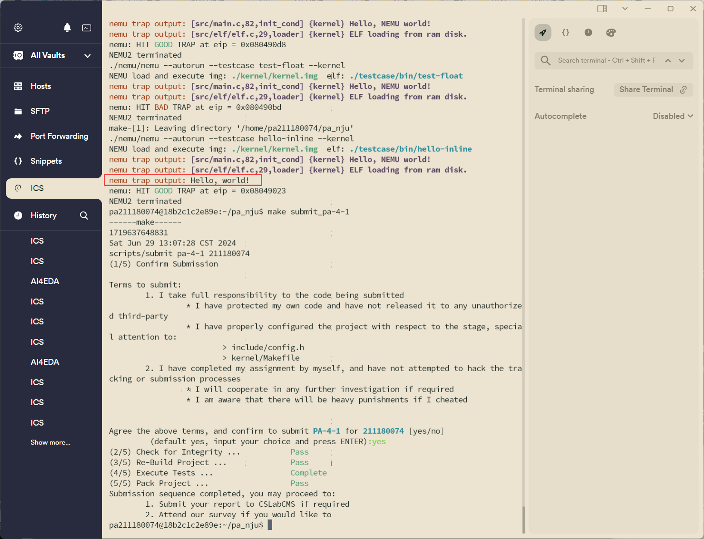
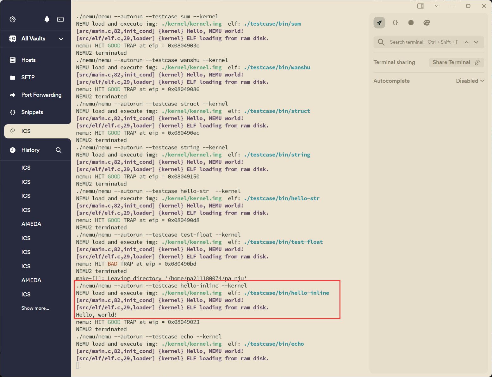
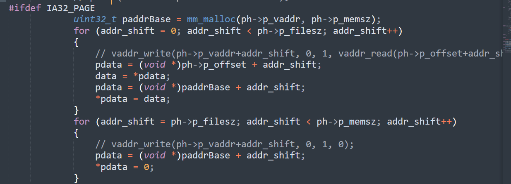
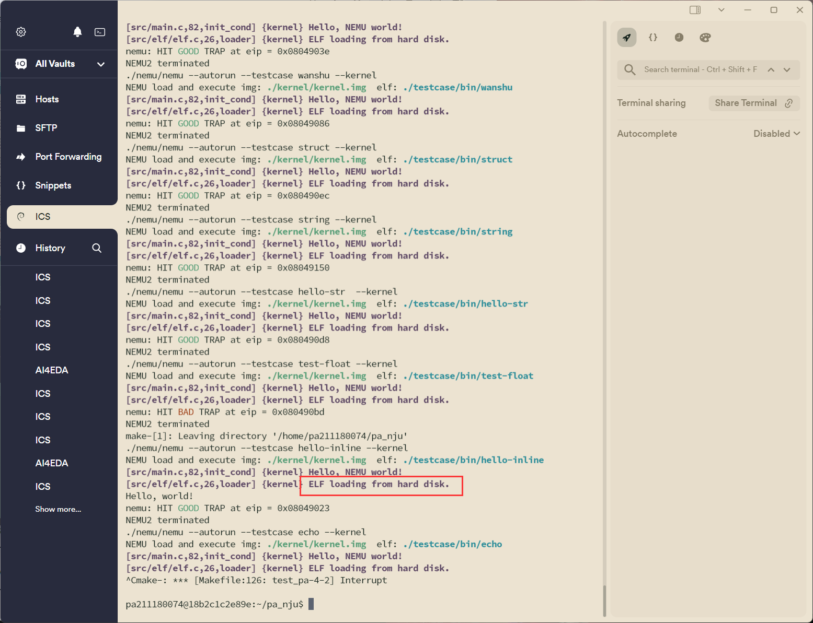
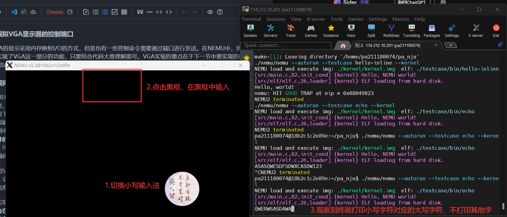
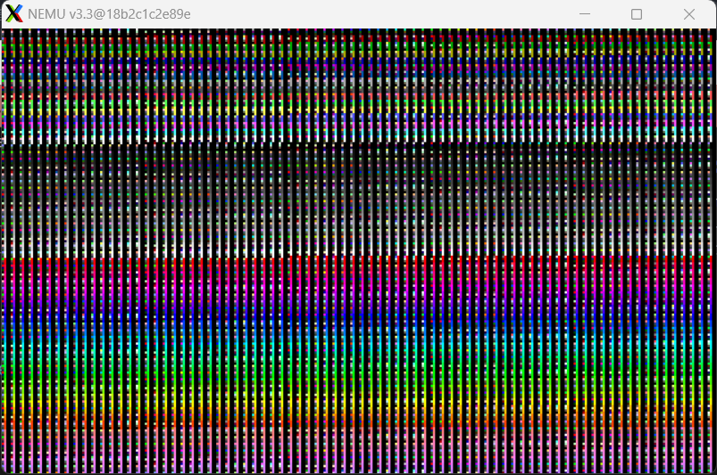
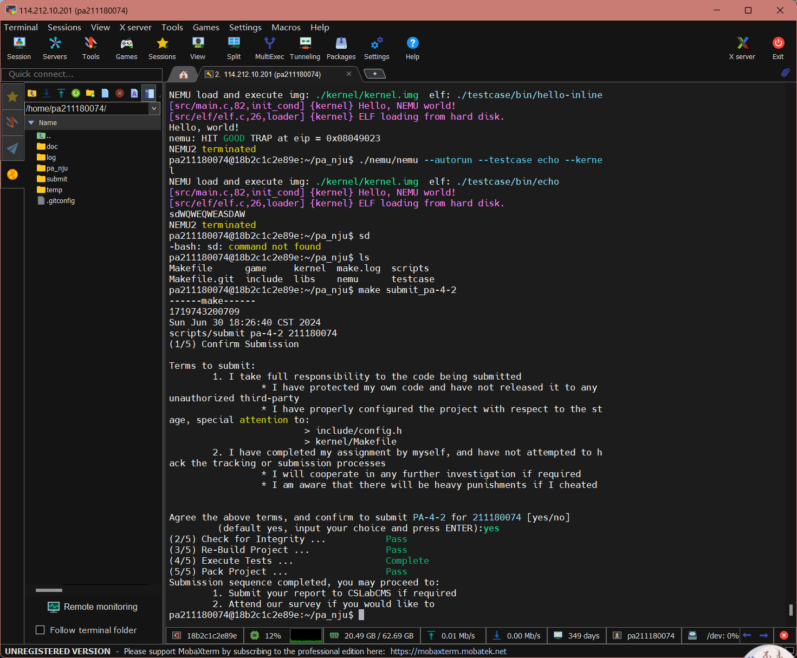

# PA4-2 实验报告

211180074 彭安澜

2024 年 6 月 30 日

## 实验代码、重点问题以及关键结果

本次实验中主要完成了以下内容的代码：

#### 1 完成串口的模拟

1. 在 `include/config.h`中定义宏 `HAS_DEVICE_SERIAL`并 `make clean`；
2. 实现 `in`和 `out`指令；
   * 此处注意不需要实现in和out以立即数imm8为操作数的两条指令，各自只要实现_v和_b的两条指令即可
   * 另外注意端口号从0-65535，总共为16位，而每个端口对应的数据为8位，因此在读端口号以及向端口读或写数据时需要注意数据宽度。
3. 实现 `serial_printc()`函数；
   * 本质就是printf函数将字符打印在终端来模拟串口的输出，但要换成 `out_byte`来实现。
4. 运行 `hello-inline`测试用例，对比实现串口前后的输出内容的区别。
   * 模拟串口前，会看到红色的nemu trap output提示输出：
     
   * 模拟串口后，会看到提示消失：
     

#### 2 通过硬盘加载程序

1. 在 `include/config.h`中定义宏 `HAS_DEVICE_ID`并 `make clean`；
2. 修改Kernel中的 `loader()`，使其通过 `ide_read()`和 `ide_write()`接口实现从模拟硬盘加载用户程序；

   * 这一部分手册提示的不多，需要自己理解代码并做出修改，源代码只在开头获取elf头使用了 `#ifdef HAS_DEVICE_IDE`并给出从硬盘读数据的例子，实际上除了读elf头的操作要做修改，后续读elf文件，将每一段（segment）加载的步骤，也要做修改，使用 `#ifdef HAS_DEVICE_IDE`，并调用 `ide_read`对elf文件进行读操作：
     
3. 通过 `make test_pa-4-2`执行测试用例，验证加载过程是否正确。
   正确加载，观察到elf文件不再从ram disk加载，而是从hard disk（硬盘）加载。
   

#### 3 完成键盘的模拟

1. 在 `include/config.h`中定义宏 `HAS_DEVICE_KEYBOARD`并 `make clean`；
2. 通过 `make test_pa-4-2`运行 `echo`测试用例；（可以通过关闭窗口或在控制台Ctrl-c的方式退出 `echo`）
   * 注意此时通过SDL调用键盘功能，必须有窗口，因此此时需要使用支持x11的mobaxterm等终端运行测试样例，否则终端界面可能发生错误。
   * 运行效果如下：
     
   * 注意如果点击终端，则还能输入，且此时的小写转大写规则不生效，此时不是nemu的键盘在起作用，而是在终端中直接输入并显示字符。

#### 4 实现VGA的MMIO

1. 在 `include/config.h`中定义宏 `HAS_DEVICE_VGA`；
2. 在 `nemu/src/memory/memory.c`中添加 `mm_io`判断和对应的读写操作；
   * 此处注意不是在memory.c中实现is_mmio()等函数（mmio部分已经在nemu\src\device\io\mm_io.c中被布置好了），重点是修改vaddr_read和vaddr_write函数，使得在访问内存区间时，实际上是访问显存io设备。
3. 在 `kernel/src/memory/vmem.c`中完成显存的恒等映射；
   * 也就是在页表中增加几项，使得虚拟地址0xa0000到0xa0000+SCR_SIZE映射到物理地址0xa0000到0xa0000+SCR_SIZE；注意按页对齐，二级页表，页目录项和页表项都要完成，用定义好的宏。
4. 通过 `make test_pa-4-2`执行测试用例，观察输出测试颜色信息，并通过 `video_mapping_read_test()`。
   * 获得测试颜色信息：
     

## 运行结果

执行 `make test_pa-4-2`，通过全部测试案例，并完成提交：

## 思考题

针对echo测试用例，在实验报告中，结合代码详细描述：

1. 注册监听键盘事件是怎么完成的？
   * 首先建立了端口映射，将端口号0x60分配给了键盘，并指定了相应的端口处理程序；这样从指令in到pio_read就能一路访问端口数据；
   * 然后设计端口处理程序，能够调用对应的设备驱动程序，将端口接受到的信息按照约定返回；
   * 最后还要创建模拟设备，按照约定与驱动程序交互，同时从用户真实的键盘设备接受信息（主要依靠窗口）。
2. 从键盘按下一个键到控制台输出对应的字符，系统的执行过程是什么？如果涉及与之前报告重复的内容，简单引用之前的内容即可。
   * 首先通过SDL注册监听键盘事件；
   * 检测到键盘事件时，引起中断，在CPU每次执行exec函数并检测中断时被检测到，CPU转向处理中断请求；
   * CPU执行异常控制流，需要保护现场、根据中断号执行中断服务程序、恢复现场，最后回到正常控制流继续执行，此部分与PA4-1内容一致。
